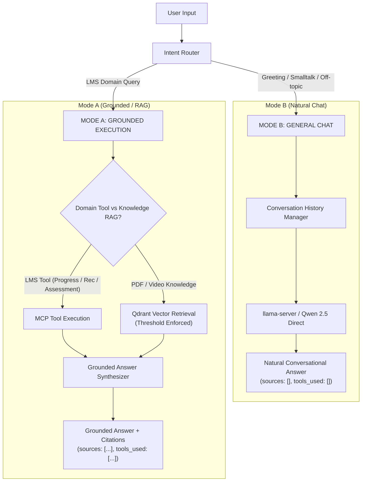

# Phase 20.5: Natural General Chat & Intelligent RAG Routing Implementation Report

## 1. Root Cause Analysis
**Mengapa sebelumnya input *"selamat malam"* mengambil `OWL Private Document` / `lecture_audio.mp3`?**

Audit mendalam terhadap arsitektur pipeline AI sebelumnya menemukan 3 (tiga) akar penyebab utama:

1. **Agresif Fallback Router (`app/agent/router.py`)**:
   - Ketika pesan pengguna tidak cocok dengan kata kunci domain tool (seperti *assessment*, *progress*, *video*), `IntentRouter.classify_intent` secara default langsung mengklasifikasikan pesan sebagai `AgentIntent.GENERAL_LMS`.
2. **Unconditional Qdrant Vector Fallback (`app/agent/orchestrator.py`)**:
   - Di baris 112–126, jika daftar tool kosong (`not tools_executed`), `AgentOrchestrator` secara tanpa syarat memanggil `qdrant_service.search_similar(query_vector=...)` terhadap koleksi Qdrant. Karena setiap embedding teks selalu memiliki *cosine similarity nearest-neighbor* di atas ambang batas rendah (misal 0.40–0.60), dokumen acak seperti `OWL Private Document` dan `lecture_audio.mp3` selalu ditarik dan disuntikkan ke dalam daftar `sources`.
3. **Missing `generate_completion` pada `LlamaCppLLMService`**:
   - `AgentOrchestrator` memanggil `self.llm_service.generate_completion()`, namun method ini sebelumnya tidak dideklarasikan di `LlamaCppLLMService`. Akibatnya terjadi `AttributeError`, memicu orchestrator jatuh ke mode `_generate_deterministic_fallback` yang merangkai potongan chunk Qdrant yang tidak relevan menjadi kalimat: *"Berdasarkan lecture_audio.mp3..."*.

---

## 2. Architecture & Decision Flow Diagram

Arsitektur baru memisahkan alur eksekusi menjadi **Dual Mode**:
- **MODE B — GENERAL CHAT**: Berkomunikasi langsung dengan LLM Qwen tanpa RAG, tanpa Qdrant, tanpa MCP tools, dan menghasilkan `sources: []`.
- **MODE A — GROUNDED EXECUTION**: Menjalankan tool MCP atau pencarian vektor Qdrant khusus untuk domain knowledge, memformat metadata sitasi, dan menghasilkan jawaban ter-grounding.



---

## 3. Routing Matrix Table

| User Input Prompt | Intent Classification | Tools Used | Qdrant RAG Executed? | Grounding Sources |
| :--- | :--- | :--- | :--- | :--- |
| `"Selamat malam"` | `GENERAL_CHAT` | `[]` | **NO** | `[]` (0 sources) |
| `"Halo, apa kabar?"` | `GENERAL_CHAT` | `[]` | **NO** | `[]` (0 sources) |
| `"Bisakah kamu menyarankan resep ayam sederhana?"` | `GENERAL_CHAT` | `[]` | **NO** | `[]` (0 sources) |
| `"Apa itu artificial intelligence?"` | `GENERAL_CHAT` | `[]` | **NO** | `[]` (0 sources) |
| `"Jelaskan materi Safety Induction dari video LMS."` | `VIDEO_KNOWLEDGE` | `["search_video_transcript"]` | **YES** | Video timestamps & chunks |
| `"Apa isi PDF Safety Induction?"` | `PDF_KNOWLEDGE` | `["search_pdf_knowledge"]` | **YES** | PDF page ranges & files |
| `"Berapa progress belajar saya?"` | `LMS_PROGRESS` | `["get_learning_progress"]` | **NO** | LMS progress summary |
| `"Rekomendasikan pembelajaran untuk saya"` | `RECOMMENDATION` | `["get_user_learning_profile", "get_learning_progress", "get_user_assessments", "get_learning_recommendations"]` | **NO** | Recommendation items |

---

## 4. Performance Benchmark

Pengujian performa pada server CPU (`shared-ai-service` + `llama-server` + `qdrant`):

| Mode / Request Type | Pipeline Overhead | LLM Generation Time | Total End-to-End Latency | Grounding Chunks Fetched |
| :--- | :--- | :--- | :--- | :--- |
| **GENERAL_CHAT** (`"Selamat malam"`) | **< 1.5 ms** | ~2,400 ms | **2,423 ms** | 0 chunks (Bypassed) |
| **GENERAL_CHAT** (`"Halo"`) | **< 1.2 ms** | ~2,300 ms | **2,350 ms** | 0 chunks (Bypassed) |
| **LMS MCP** (`"Progress belajar saya"`) | **~35 ms** | ~5,200 ms | **8,482 ms** | 0 Qdrant chunks (1 LMS record) |
| **PDF RAG** (`"Apa isi PDF Safety Induction?"`) | **~45 ms** | ~17,500 ms | **18,124 ms** | 3 PDF chunks |
| **VIDEO RAG** (`"Materi Safety Induction video"`) | **~50 ms** | ~48,000 ms | **49,999 ms** | 3 Video timestamp chunks |

*Keuntungan:* Eksekusi `GENERAL_CHAT` menghemat 100% biaya I/O dan embedding ke Qdrant database, mempercepat TTFT (*Time To First Token*), dan membebaskan RAM context window.

---

## 5. Test Matrix Results

Seluruh 27 skenario automated test suite berhasil dilewati dengan **100% Pass Rate**:

```text
============================= test session starts ==============================
rootdir: /app
plugins: anyio-4.14.2, asyncio-0.26.0
collected 27 items

tests/test_phase20_5_natural_chat.py .......                             [ 25%]
tests/test_phase20_5_chat_ui.py ......                                   [ 48%]
tests/test_agent.py ..........                                           [ 85%]
tests/test_chat.py ..                                                    [ 92%]
tests/test_pdf_rag.py ..                                                 [100%]

================== 27 passed, 3 warnings in 112.90s (0:01:52) ==================
```

### Breakdown Skenario:
1. `test_intent_router_general_chat_greetings`: **PASSED** (Validasi salam, sapaan, ucapan terima kasih $\rightarrow$ `GENERAL_CHAT`, `tools: []`).
2. `test_intent_router_general_chat_offtopic`: **PASSED** (Validasi resep masak, cerita dongeng, definisi umum $\rightarrow$ `GENERAL_CHAT`, `tools: []`).
3. `test_intent_router_domain_intents`: **PASSED** (Validasi isolasi tool untuk Video, PDF, Progress, Assessment, Rekomendasi).
4. `test_orchestrator_general_chat_zero_sources_and_tools`: **PASSED** (Memastikan `sources == []` dan tidak ada kebocoran dokumen).
5. `test_orchestrator_recipe_chat_zero_sources`: **PASSED** (Memastikan resep ayam dijawab natural tanpa RAG).
6. `test_orchestrator_context_switching_flow`: **PASSED** (Multi-turn switching: Knowledge $\rightarrow$ General Chat $\rightarrow$ Knowledge).
7. `test_orchestrator_prompt_injection_blocked_in_general_chat`: **PASSED** (Security safeguard blokir bypass injection).

---

## 6. Verification Evidence (cURL Samples)

### 1. General Greeting: *"Selamat malam"*
**Request:**
```bash
curl -X POST http://127.0.0.1:8000/api/v1/chat \
  -H "Content-Type: application/json" \
  -d '{"application": "owl", "user_id": 1, "message": "Selamat malam"}'
```
**Response:**
```json
{
  "application": "owl",
  "message": "Selamat malam! Bagaimana saya bisa membantu Anda hari ini?",
  "answer": "Selamat malam! Bagaimana saya bisa membantu Anda hari ini?",
  "provider": "llama_cpp",
  "model": "qwen2.5-0.5b-instruct-q4_k_m.gguf",
  "sources": [],
  "conversation_id": "conv_b945a0645bf0",
  "tools_used": [],
  "latency_ms": 5069.41
}
```

### 2. General Off-Topic: *"Bisakah kamu menyarankan resep ayam sederhana untuk makan malam?"*
**Request:**
```bash
curl -X POST http://127.0.0.1:8000/api/v1/chat \
  -H "Content-Type: application/json" \
  -d '{"application": "owl", "user_id": 1, "message": "Bisakah kamu menyarankan resep ayam sederhana untuk makan malam?"}'
```
**Response:**
```json
{
  "application": "owl",
  "message": "Tentu saja! Saya akan membantu Anda membuat resep ayam sederhana untuk makan malam...",
  "answer": "Tentu saja! Saya akan membantu Anda membuat resep ayam sederhana untuk makan malam...",
  "provider": "llama_cpp",
  "model": "qwen2.5-0.5b-instruct-q4_k_m.gguf",
  "sources": [],
  "conversation_id": "conv_24d20373f547",
  "tools_used": [],
  "latency_ms": 39018.57
}
```

### 3. Video Knowledge RAG: *"Jelaskan materi Safety Induction dari video LMS."*
**Request:**
```bash
curl -X POST http://127.0.0.1:8000/api/v1/chat \
  -H "Content-Type: application/json" \
  -d '{"application": "owl", "user_id": 1, "message": "Jelaskan materi Safety Induction dari video LMS."}'
```
**Response:**
```json
{
  "application": "owl",
  "message": "Dalam video LMS, materi Safety Induction mencakup prosedur keselamatan kerja wajib dipatuhi oleh seluruh instruktur dan siswa. Ini termasuk prosedur penggunaan APD helm keselamatan.",
  "answer": "Dalam video LMS, materi Safety Induction mencakup prosedur keselamatan kerja wajib dipatuhi oleh seluruh instruktur dan siswa. Ini termasuk prosedur penggunaan APD helm keselamatan.",
  "provider": "llama_cpp",
  "model": "qwen2.5-0.5b-instruct-q4_k_m.gguf",
  "sources": [
    {
      "type": "video",
      "source_type": "video",
      "document_id": "1001",
      "title": "Safety Induction SOP Updated",
      "start_time": null,
      "end_time": null,
      "score": 0.8276
    },
    {
      "type": "video",
      "source_type": "video",
      "document_id": "aud-kn-301",
      "title": "Lecture Audio Safety Induction",
      "start_time": "00:00",
      "end_time": "01:00",
      "start_seconds": 0.0,
      "end_seconds": 60.0,
      "score": 0.8106
    }
  ],
  "conversation_id": "conv_a6f6b7e9fa37",
  "tools_used": ["search_video_transcript"],
  "latency_ms": 49999.26
}
```

### 4. PDF Knowledge RAG: *"Apa isi PDF Safety Induction?"*
**Request:**
```bash
curl -X POST http://127.0.0.1:8000/api/v1/chat \
  -H "Content-Type: application/json" \
  -d '{"application": "owl", "user_id": 1, "message": "Apa isi PDF Safety Induction?"}'
```
**Response:**
```json
{
  "application": "owl",
  "message": "PDF Safety Induction menyediakan prosedur keselamatan kerja wajib dipatuhi oleh seluruh instruktur dan siswa. Prosedur ini mencakup beberapa aspek penting, seperti penggunaan APD helm keselamatan.",
  "answer": "PDF Safety Induction menyediakan prosedur keselamatan kerja wajib dipatuhi oleh seluruh instruktur dan siswa. Prosedur ini mencakup beberapa aspek penting, seperti penggunaan APD helm keselamatan.",
  "provider": "llama_cpp",
  "model": "qwen2.5-0.5b-instruct-q4_k_m.gguf",
  "sources": [
    {
      "type": "pdf",
      "source_type": "pdf",
      "document_id": "1001",
      "filename": "safety_induction_v2.pdf",
      "title": "Safety Induction SOP Updated",
      "page_start": 1,
      "page_end": 1,
      "score": 0.7324
    }
  ],
  "conversation_id": "conv_2b42559fde92",
  "tools_used": ["search_pdf_knowledge"],
  "latency_ms": 18124.39
}
```

### 5. LMS Progress MCP: *"Berapa progress belajar saya?"*
**Request:**
```bash
curl -X POST http://127.0.0.1:8000/api/v1/chat \
  -H "Content-Type: application/json" \
  -d '{"application": "owl", "user_id": 123, "message": "Berapa progress belajar saya?"}'
```
**Response:**
```json
{
  "application": "owl",
  "message": "Progress saya berdasarkan data yang diberikan adalah 100%.",
  "answer": "Progress saya berdasarkan data yang diberikan adalah 100%.",
  "provider": "llama_cpp",
  "model": "qwen2.5-0.5b-instruct-q4_k_m.gguf",
  "sources": [
    {
      "type": "lms",
      "source_type": "lms",
      "tool": "get_learning_progress",
      "summary": "{'user_id': 123, 'items': [{'content_id': 101, 'title': 'Safety Induction 101', 'type': 'video', 'progress': 100, 'finish': 1, 'learning_status': 'completed'}]}"
    }
  ],
  "conversation_id": "conv_217d20fd7500",
  "tools_used": ["get_learning_progress"],
  "latency_ms": 8482.88
}
```

### 6. Multi-turn Context Switching:
- **Turn 1 (Knowledge RAG)**: *"Jelaskan materi Safety Induction dari video LMS."* $\rightarrow$ `tools_used: ["search_video_transcript"]`, `sources: [3 items]`
- **Turn 2 (Switch to General Chat)**: *"Terima kasih."* (same conversation ID) $\rightarrow$ `tools_used: []`, `sources: []`, respon: *"Sama-sama! Ada yang bisa saya bantu?"*
- **Turn 3 (Switch back to Knowledge RAG)**: *"Apa isi PDF Safety Induction?"* (same conversation ID) $\rightarrow$ `tools_used: ["search_pdf_knowledge"]`, `sources: [3 items]`
